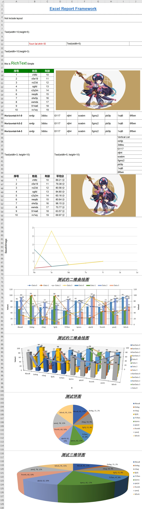

# Excel 报表框架

> 极简化的复杂Excel报表导出框架，支持手动编码、模板文件两种方式导出Excel模板。

版本更新日志: [version log](VERSION.md)

## 特点

1. 几乎完全屏蔽POI操作，提供类UI框架的操作接口、定义报表极其简单
2. 提供模板文件定义，类似于各种模板框架，支持SPEL表达式的模板定义
3. 提供类似于 Themleaf 的 If, For 标签，更方便定义模板
4. 自动计算组件位置
5. 简化CellStyle设置

## 使用方式（模板方式、推荐）

1. 引入依赖

```xml

<dependency>
    <groupId>io.github.mengfly</groupId>
    <artifactId>excel-report</artifactId>
    <version>1.3.0</version>
</dependency>
```

### 2. 定义报表模板

以下为实例：

具体的模板实例可以参考：[模板文件](src/test/resources/TestTemplate.xml)

```xml
<?xml version="1.0" encoding="UTF-8" ?>
<template
        xmlns="http://mengfly.github.io/excel-report/1.0.0"
        xmlns:xsi="http://www.w3.org/2001/XMLSchema-instance"
        xsi:schemaLocation="http://mengfly.github.io/excel-report/1.0.0 https://mengfly.github.io/xsd/excel-report-1.0.0.xsd"
        name="testImage"
        description="测试模板"
        version="1.0"
        author="MengFly"
        createAt="2023-12-26">

    <!--  定义模板参数，该参数无特殊意义，只是为了统一放在这里方便对模板内的参数统一展示，方便了解模板参数数据  -->
    <parameters>
        <parameter id="parameter" name="参数名称"/>
    </parameters>

    <!--  Sheet 页参数，一个模板文件对应一个sheet页  -->
    <sheetStyle>
        <autobreaks>true</autobreaks>
        <!--    ...    -->
    </sheetStyle>

    <styles>
        <!--    定义Cell样式表，可以在下面的组件中引用    -->
        <style id="testStyle">

        </style>

        <style id="testStyle2">

        </style>
    </styles>

    <!--  编写模板结构，使用表达式传递数据   -->
    <container>
        <VLayout style="testStyle testStyle2">
            <HLayout style="{width:auto}">
                <Text text="${value}"/>
            </HLayout>
        </VLayout>
    </container>
</template>
```

### 3. 传递参数，渲染模板

```java
import io.github.mengfly.excel.report.excel.ExcelReport;

public static void main(String[] args) {
    // 创建报表类
    ExcelReport report = new ExcelReport();

    // 构建数据参数
    DataContext context = new DataContext();
    context.put("image", TestDataUtil.getTestImageFile());
    context.put("tableData", TestDataUtil.getData(10));
    context.put("listData", TestDataUtil.getRandomStringList(9));
    // ...

    try (InputStream stream = getClass().getClassLoader().getResourceAsStream("TestTemplate.xml")) {
        // 加载模板
        ReportTemplate template = new ReportTemplate(stream);

        // 导出模板到Sheet页， 一个ExcelReport 代表了一个Excel文件，每次调用export就是在向里面添加一个Sheet页
        report.exportTemplate(template, FileUtil.mainName(templatePath), context);
    }


    // 存储文件
    report.save(new File("test-template.xlsx"));
}

```

### 4. 最终效果
